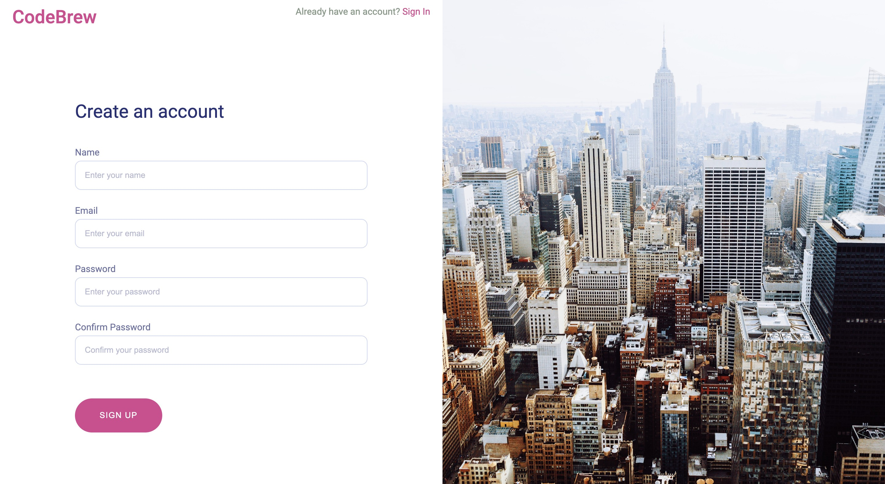
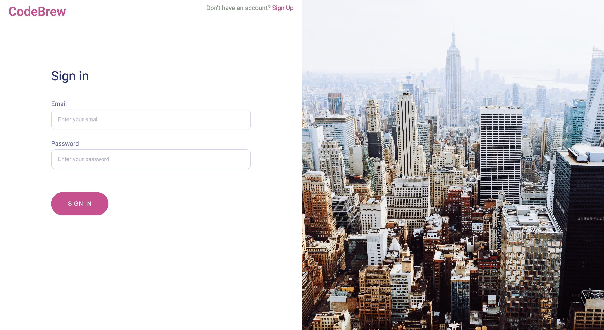
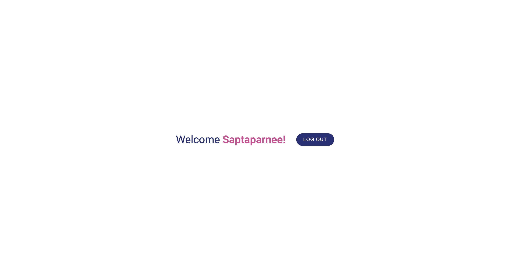
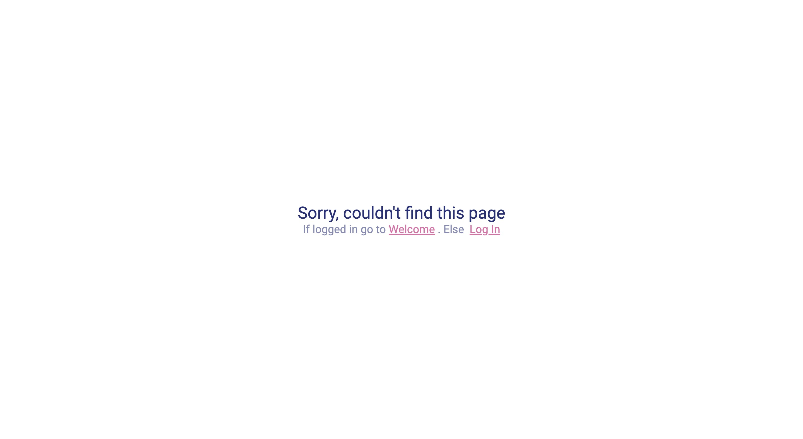

## Overview

This is a user authentication app created using the MERN stack.
The user can:

1. Create an account
2. Login with their existing account
3. Logout

The frontend has been create with create-react-app.
The app has made use of

1. React-Router v6
2. React-Redux and Redux Toolkit

The database used is MongoDB.

### Screenshot

Create an account page.

Login Page

Welcome page

Not found page

### Links

- Live Site URL: [https://user-auth-youtube-app.herokuapp.com/]
